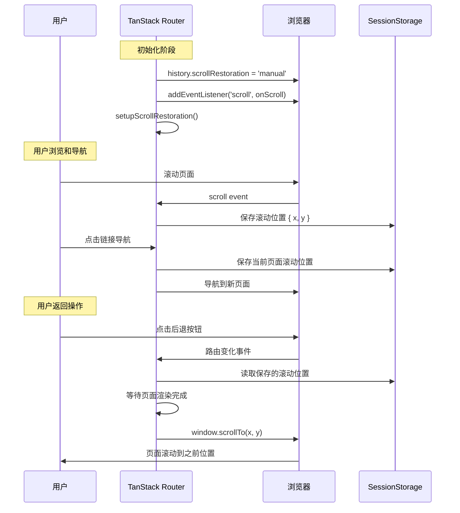

在现代单页应用（SPA）开发中，用户体验的优化往往体现在细节处理上。其中，滚动位置的恢复功能是一个看似简单但技术含量很高的特性。本文将深入分析 TanStack Router 中 `scrollRestoration` 功能的实现原理，从基本概念到源码解析，全面解读这一重要特性。

<!-- more -->

## 什么是 scrollRestoration？

`scrollRestoration` 是 TanStack Router 提供的一个配置选项，它控制页面滚动位置的恢复行为。当设置为 `true` 时，它会：

- **自动保存滚动位置**：当用户离开页面时，保存当前的滚动位置
- **自动恢复滚动位置**：当用户返回页面时，恢复到之前的滚动位置
- **提升用户体验**：避免用户在导航后需要重新滚动到之前浏览的位置

## 使用场景举例

### 电商网站场景
假设用户在商品列表页浏览：

**没有 scrollRestoration 的情况**：
1. 用户滚动到第 50 个商品位置
2. 点击某个商品进入详情页
3. 点击浏览器后退按钮返回列表页
4. 页面回到顶部，用户需要重新滚动找到第 50 个商品 😫

**启用 scrollRestoration 的情况**：
1. 用户滚动到第 50 个商品位置
2. 点击某个商品进入详情页
3. 点击浏览器后退按钮返回列表页
4. 页面自动滚动到第 50 个商品位置 😊

### 其他应用场景
- **社交媒体 Feed**：滚动到第 100 条动态，点击评论后返回，还在第 100 条的位置
- **文档阅读**：在长文档中间位置，点击链接后返回，还在原来的阅读位置
- **搜索结果**：查看第 3 页搜索结果中的某项，返回后还在第 3 页

## 基本配置和使用

```typescript
// src/router.tsx
import { createRouter } from '@tanstack/react-router'
import { routeTree } from './routeTree.gen'

export function createRouter() {
    const router = createRouter({ 
        routeTree,
        scrollRestoration: true, // 启用滚动位置恢复
    })
    
    return router
}
```

## 技术实现原理

### 1. 浏览器 History API 基础

现代浏览器提供了原生的滚动恢复控制：

```javascript
// 浏览器原生的 scrollRestoration
history.scrollRestoration = 'auto'    // 浏览器自动管理
history.scrollRestoration = 'manual'  // 手动管理
```

TanStack Router 通过设置 `history.scrollRestoration = 'manual'` 来接管滚动恢复的控制权。

### 2. 滚动位置的保存机制

当路由变化时，TanStack Router 会保存当前滚动位置：

```typescript
// 滚动位置保存的概念实现
const saveScrollPosition = () => {
  const scrollData = {
    x: window.scrollX,
    y: window.scrollY,
    timestamp: Date.now()
  }
  
  // 保存到 sessionStorage
  const restoreKey = getKey(router.state.location)
  scrollRestorationCache.set(restoreKey, {
    'window': scrollData
  })
}
```

### 3. 滚动位置的恢复机制

当返回到页面时，恢复滚动位置：

```typescript
// 滚动位置恢复的概念实现
const restoreScrollPosition = (routeState) => {
  if (routeState.scrollPosition) {
    // 等待页面渲染完成
    requestAnimationFrame(() => {
      window.scrollTo({
        top: routeState.scrollPosition.y,
        left: routeState.scrollPosition.x,
        behavior: 'auto' // 或 'smooth'
      })
    })
  }
}
```

### 4. 关键时机控制

**保存时机**：
- 用户点击链接离开页面前
- 浏览器前进/后退导航前
- 路由变化触发前

**恢复时机**：
- 页面组件挂载完成后
- DOM 渲染完成后
- 使用 `requestAnimationFrame` 确保布局完成

## 源码深度解析

基于 TanStack Router 官方源码的深入分析，以下是 `scrollRestoration` 功能的具体实现：

### 1. createRouter 函数入口

**文件位置**：`packages/react-router/src/router.ts:80`

```typescript
export const createRouter: CreateRouterFn = (options) => {
  return new Router(options)
}
```

### 2. scrollRestoration 选项定义

**文件位置**：`packages/router-core/src/router.ts:390-414`

```typescript
export interface RouterOptions<...> {
  /**
   * If `true`, scroll restoration will be enabled
   * @default false
   */
  scrollRestoration?: boolean

  /**
   * A function that will be called to get the key for the scroll restoration cache.
   * @default (location) => location.href
   */
  getScrollRestorationKey?: (location: ParsedLocation) => string
  
  /**
   * The default behavior for scroll restoration.
   * @default 'auto'
   */
  scrollRestorationBehavior?: ScrollBehavior
  
  /**
   * An array of selectors that will be used to scroll to the top of the page in addition to `window`
   * @default ['window']
   */
  scrollToTopSelectors?: Array<string | (() => Element | null | undefined)>
}
```

### 3. Router 初始化中的滚动恢复设置

**文件位置**：`packages/router-core/src/router.ts:924`

```typescript
// 在 Router 的 update 方法中
if (!this.__store) {
  this.__store = new Store(getInitialRouterState(this.latestLocation), {
    onUpdate: () => {
      // ...
    },
  })

  setupScrollRestoration(this) // 关键：在这里初始化滚动恢复
}
```

### 4. setupScrollRestoration 核心实现

**文件位置**：`packages/router-core/src/scroll-restoration.ts:209-353`

```typescript
export function setupScrollRestoration(router: AnyRouter, force?: boolean) {
  if (scrollRestorationCache === undefined) {
    return
  }
  
  const shouldScrollRestoration = force ?? router.options.scrollRestoration ?? false

  if (shouldScrollRestoration) {
    router.isScrollRestoring = true
  }

  if (typeof document === 'undefined' || router.isScrollRestorationSetup) {
    return
  }

  router.isScrollRestorationSetup = true

  const getKey = router.options.getScrollRestorationKey || defaultGetScrollRestorationKey

  // 关键：设置浏览器的滚动恢复为手动模式
  window.history.scrollRestoration = 'manual'

  // 监听滚动事件并缓存滚动位置
  const onScroll = (event: Event) => {
    if (ignoreScroll || !router.isScrollRestoring) {
      return
    }

    let elementSelector = ''

    if (event.target === document || event.target === window) {
      elementSelector = 'window'
    } else {
      const attrId = (event.target as Element).getAttribute('data-scroll-restoration-id')

      if (attrId) {
        elementSelector = `[data-scroll-restoration-id="${attrId}"]`
      } else {
        elementSelector = getCssSelector(event.target)
      }
    }

    const restoreKey = getKey(router.state.location)

    // 保存滚动位置到 sessionStorage
    scrollRestorationCache.set((state) => {
      const keyEntry = (state[restoreKey] = state[restoreKey] || {})
      const elementEntry = (keyEntry[elementSelector] = keyEntry[elementSelector] || {})

      if (elementSelector === 'window') {
        elementEntry.scrollX = window.scrollX || 0
        elementEntry.scrollY = window.scrollY || 0
      } else if (elementSelector) {
        const element = document.querySelector(elementSelector)
        if (element) {
          elementEntry.scrollX = element.scrollLeft || 0
          elementEntry.scrollY = element.scrollTop || 0
        }
      }

      return state
    })
  }

  // 节流处理滚动事件，每 100ms 最多触发一次
  if (typeof document !== 'undefined') {
    document.addEventListener('scroll', throttle(onScroll, 100), true)
  }

  // 监听路由渲染完成事件，恢复滚动位置
  router.subscribe('onRendered', (event) => {
    const cacheKey = getKey(event.toLocation)

    if (!router.resetNextScroll) {
      router.resetNextScroll = true
      return
    }

    restoreScroll({
      storageKey,
      key: cacheKey,
      behavior: router.options.scrollRestorationBehavior,
      shouldScrollRestoration: router.isScrollRestoring,
      scrollToTopSelectors: router.options.scrollToTopSelectors,
      location: router.history.location,
    })
  })
}
```

### 5. restoreScroll 滚动恢复实现

**文件位置**：`packages/router-core/src/scroll-restoration.ts:104-207`

```typescript
export function restoreScroll({
  storageKey,
  key,
  behavior,
  shouldScrollRestoration,
  scrollToTopSelectors,
  location,
}: {
  storageKey: string
  key?: string
  behavior?: ScrollToOptions['behavior']
  shouldScrollRestoration?: boolean
  scrollToTopSelectors?: Array<string | (() => Element | null | undefined)>
  location?: HistoryLocation
}) {
  let byKey: ScrollRestorationByKey

  try {
    byKey = JSON.parse(sessionStorage.getItem(storageKey) || '{}')
  } catch (error: any) {
    console.error(error)
    return
  }

  const resolvedKey = key || window.history.state?.key
  const elementEntries = byKey[resolvedKey]

  ignoreScroll = true

  // 优先恢复缓存的滚动位置
  if (shouldScrollRestoration && elementEntries && Object.keys(elementEntries).length > 0) {
    for (const elementSelector in elementEntries) {
      const entry = elementEntries[elementSelector]!
      if (elementSelector === 'window') {
        window.scrollTo({
          top: entry.scrollY,
          left: entry.scrollX,
          behavior,
        })
      } else if (elementSelector) {
        const element = document.querySelector(elementSelector)
        if (element) {
          element.scrollLeft = entry.scrollX
          element.scrollTop = entry.scrollY
        }
      }
    }
    return
  }

  // 处理 hash 滚动
  const hash = (location ?? window.location).hash.split('#')[1]

  if (hash) {
    const hashScrollIntoViewOptions = (window.history.state || {}).__hashScrollIntoViewOptions ?? true

    if (hashScrollIntoViewOptions) {
      const el = document.getElementById(hash)
      if (el) {
        el.scrollIntoView(hashScrollIntoViewOptions)
      }
    }
    return
  }

  // 默认滚动到页面顶部
  ['window', ...(scrollToTopSelectors?.filter((d) => d !== 'window') ?? [])].forEach((selector) => {
    const element = selector === 'window' ? window : typeof selector === 'function' ? selector() : document.querySelector(selector)
    if (element) {
      element.scrollTo({
        top: 0,
        left: 0,
        behavior,
      })
    }
  })

  ignoreScroll = false
}
```

### 6. 缓存系统实现

**文件位置**：`packages/router-core/src/scroll-restoration.ts:36-73`

```typescript
// 存储键定义
export const storageKey = 'tsr-scroll-restoration-v1_3'

// 节流函数实现
const throttle = (fn: (...args: Array<any>) => void, wait: number) => {
  let timeout: any
  return (...args: Array<any>) => {
    if (!timeout) {
      timeout = setTimeout(() => {
        fn(...args)
        timeout = null
      }, wait)
    }
  }
}

// 创建滚动恢复缓存
function createScrollRestorationCache(): ScrollRestorationCache | undefined {
  const safeSessionStorage = getSafeSessionStorage()
  if (!safeSessionStorage) {
    return undefined
  }

  const persistedState = safeSessionStorage.getItem(storageKey)
  let state: ScrollRestorationByKey = persistedState ? JSON.parse(persistedState) : {}

  return {
    state,
    set: (updater) => (
      (state = functionalUpdate(updater, state) || state),
      safeSessionStorage.setItem(storageKey, JSON.stringify(state))
    ),
  }
}

export const scrollRestorationCache = createScrollRestorationCache()
```

### 6. 数据存储结构

```typescript
// sessionStorage 中的数据结构
{
  "tsr-scroll-restoration-v1_3": {
    "/products": {          // 路由路径作为 key
      "window": {           // 元素选择器
        "scrollX": 0,
        "scrollY": 1250
      }
    },
    "/products/123": {
      "window": {
        "scrollX": 0,
        "scrollY": 800
      }
    }
  }
}
```

## 滚动恢复工作流程



## 高级特性

### 1. 多元素滚动支持

TanStack Router 不仅支持 window 级别的滚动，还支持页面内滚动容器：

```typescript
// 支持多个滚动元素
const elementSelector = event.target === window 
  ? 'window' 
  : getCssSelector(event.target)

// 为特定元素设置滚动恢复 ID
<div data-scroll-restoration-id="product-list" className="overflow-auto">
  {/* 滚动内容 */}
</div>
```

### 2. 自定义滚动恢复键

```typescript
const router = createRouter({
  routeTree,
  scrollRestoration: true,
  getScrollRestorationKey: (location) => {
    // 自定义缓存键生成策略
    return `${location.pathname}${location.search}`
  }
})
```

### 3. 滚动行为配置

```typescript
const router = createRouter({
  routeTree,
  scrollRestoration: true,
  scrollRestorationBehavior: 'smooth', // 'auto' | 'smooth'
  scrollToTopSelectors: ['window', '.main-content']
})
```

## 性能优化机制

### 1. 事件防抖

```typescript
// 使用节流函数，每 100ms 最多触发一次保存
document.addEventListener('scroll', throttle(onScroll, 100), true)
```

### 2. 智能忽略机制

```typescript
let ignoreScroll = false // 防止恢复滚动时触发保存

const restoreScroll = () => {
  ignoreScroll = true
  window.scrollTo(x, y)
  setTimeout(() => {
    ignoreScroll = false
  }, 100)
}
```

### 3. 渲染完成检测

```typescript
// 使用 requestAnimationFrame 确保 DOM 渲染完成
requestAnimationFrame(() => {
  window.scrollTo({
    top: savedPosition.y,
    left: savedPosition.x,
    behavior: 'auto'
  })
})
```

## 边界情况处理

### 1. 页面高度变化

```typescript
// 处理动态内容加载导致的页面高度变化
const restoreWithRetry = (targetY) => {
  let attempts = 0
  const maxAttempts = 10
  
  const tryRestore = () => {
    const currentHeight = document.body.scrollHeight
    
    if (currentHeight >= targetY || attempts >= maxAttempts) {
      window.scrollTo(0, Math.min(targetY, currentHeight))
      return
    }
    
    attempts++
    setTimeout(tryRestore, 100) // 延迟重试
  }
  
  tryRestore()
}
```

### 2. Hash 链接处理

```typescript
// 优先处理 hash 滚动
const hash = window.location.hash.split('#')[1]
if (hash) {
  const element = document.getElementById(hash)
  if (element) {
    element.scrollIntoView()
    return
  }
}
```

### 3. 错误处理

```typescript
try {
  const cachedData = JSON.parse(sessionStorage.getItem(storageKey) || '{}')
} catch (error) {
  console.error('Failed to parse scroll restoration data:', error)
  // 降级到默认行为
  window.scrollTo(0, 0)
}
```

## 总结

TanStack Router 的 `scrollRestoration` 功能通过以下关键技术实现了精确的滚动位置恢复：

1. **浏览器 API 接管**：通过 `history.scrollRestoration = 'manual'` 接管浏览器原生行为
2. **事件监听机制**：监听 scroll 事件，实时保存滚动位置
3. **SessionStorage 持久化**：使用 sessionStorage 跨页面保存滚动数据
4. **智能恢复策略**：结合 requestAnimationFrame 和重试机制确保准确恢复
5. **性能优化**：通过防抖、忽略机制等优化性能
6. **多元素支持**：不仅支持 window 滚动，还支持页面内滚动容器

这个功能看似简单，但其实现涉及了深度的浏览器 API 理解、事件处理优化、数据持久化策略等多个技术层面。通过源码分析，我们可以看到 TanStack Router 团队在用户体验优化上的细致考虑和技术深度。

对于现代 SPA 应用来说，启用 `scrollRestoration: true` 是一个简单而有效的用户体验提升方案。它不仅技术实现精巧，更重要的是真正解决了用户在应用中导航时的痛点问题。